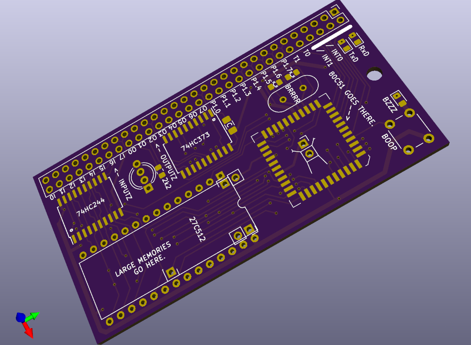
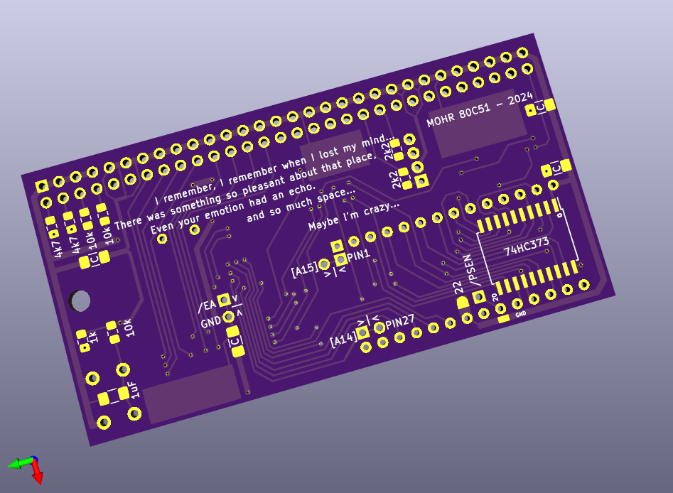

# 8051recyclerPCB
External memory card for PLCC 8051 OTP processors

PCB designed for recycling OTP PLCC 8051 chips. 

Becasue using the 8051 with external memory burns off most of the ports, I have added two chips that use the external RAM space for an input and output port. Any write to external memory will go to the dedicated output port, and any read from external memory will read the dedicated input port.

(I hope your fine with the in-chip ram :] )

*not tested yet (oct 2024) *
