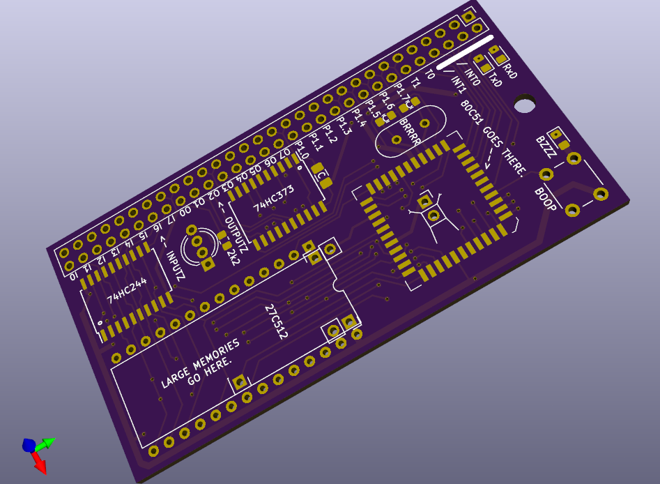
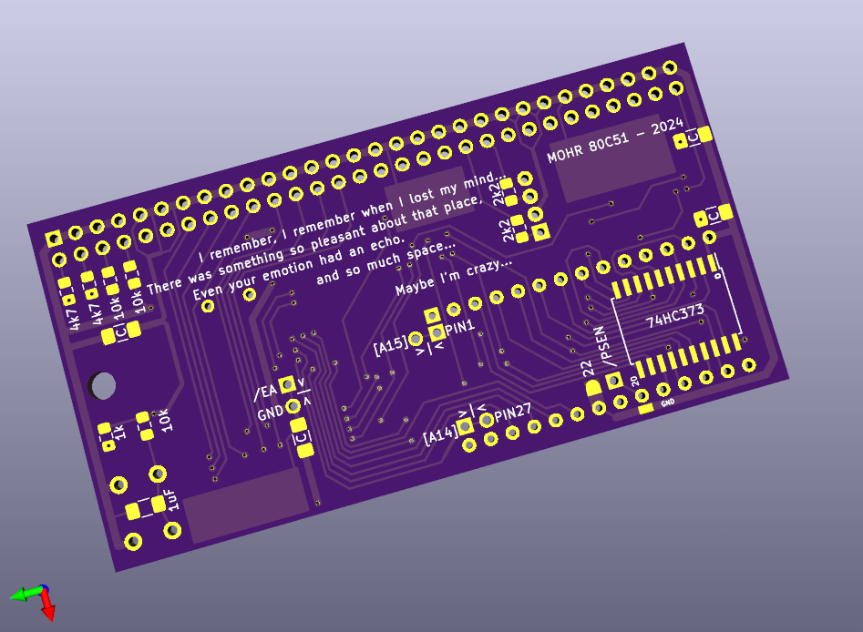

# 8051recyclerPCB
External memory card for PLCC 8051 OTP processors

PCB designed for recycling OTP PLCC 8051 chips. 

Becasue using the 8051 with external memory burns off most of the ports, I have added two chips that use the external RAM space for an input and output port. Any write to external memory will go to the dedicated output port, and any read from external memory will read the dedicated input port.

(I hope your fine with the in-chip ram :] )

ERATTA:

- The output chip needs to be 74xx374 or another pin compatible chip but sure the heck not the 74xx373
- Oh, maybe those serial leds ought to be active low eh?
- Ya know that trace to that top decoupling cap dunn't need to be only 10 thou.

IMPROVA:

- Could there please be a mark on the common cathode pin of that damn led?
- Could someone please mark the xtal pin for extern clock input?
- Ya know that trace to that top decoupling cap dunn't need to be only 10 thou.
- break out pins 1, 12, 23, 34 to pads incase they need bodge connections
- align the pin 27 connection with VCC for easier bridging to use 2764 roms. (haha wait no, there are only 28 pins)

